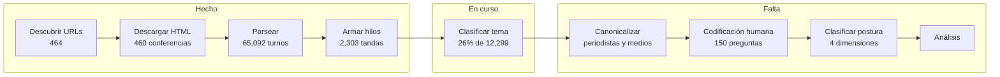
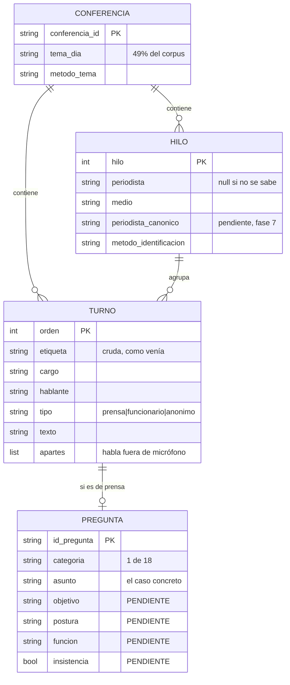
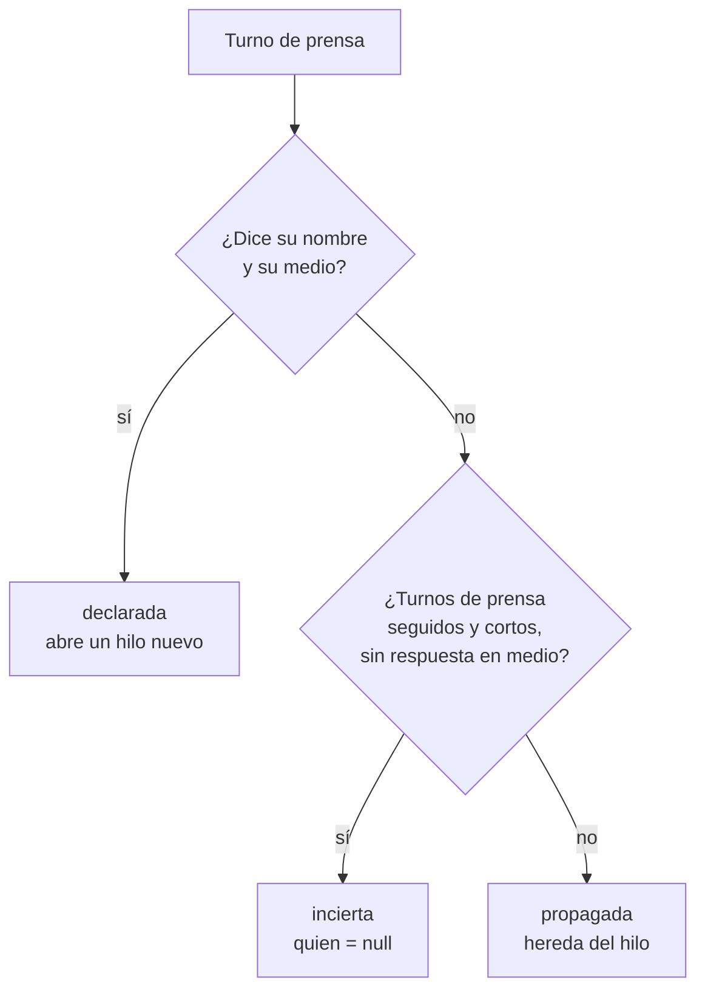
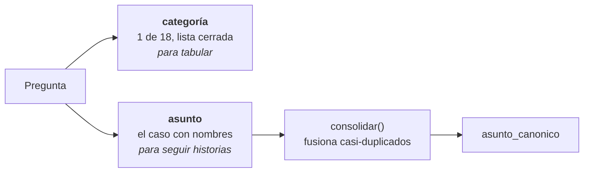
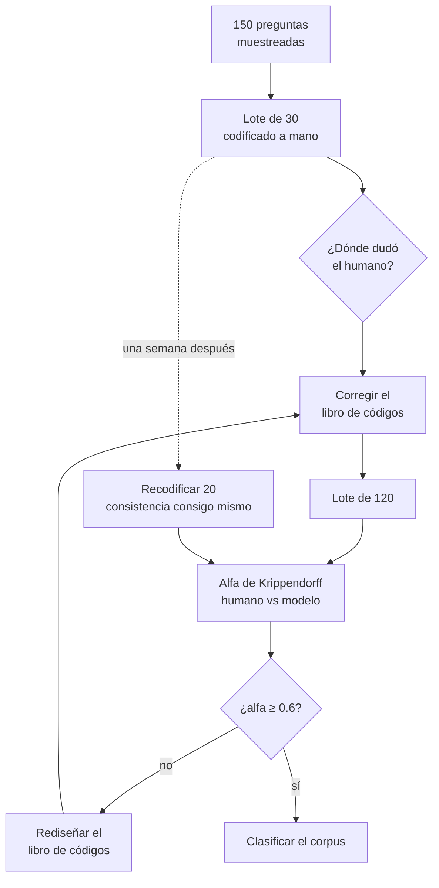

# Preguntas matutinas

Análisis de contenido de las versiones estenográficas de las conferencias de prensa matutinas de la Presidencia de México. La pregunta de investigación es si las preguntas que hace la prensa son confrontativas o favorables hacia el gobierno, y cómo se distribuye eso entre medios, periodistas y temas.

**Corpus: 460 conferencias, del 3 de octubre de 2024 al 20 de agosto de 2026.** 65,092 turnos de habla, 27,278 de prensa, 2,303 tandas de periodista, 22,438 preguntas útiles.

> **Estado: a medio camino.** El corpus está descargado, parseado y clasificado por tema. **Las preguntas todavía no están clasificadas por postura**, así que no existe ningún resultado sobre confrontación ni deferencia. Lo que sí hay son los conteos descriptivos de quién recibe la palabra y de qué pregunta, con las limitaciones que se detallan abajo.

---

## Dónde va el trabajo



La codificación humana está antes de la clasificación de postura **a propósito, y el orden no se negocia**. Ver "Validación".

## Por qué el diseño es así

El objeto de estudio es políticamente cargado. Eso impone tres decisiones que atraviesan todo el proyecto.

**No se colapsa en un solo eje.** Una pregunta puede ser durísima contra la oposición, lo cual favorece al gobierno sin ser un halago. Cada pregunta se clasifica en cuatro dimensiones independientes; un índice único de "dureza" borraría justo esa distinción.

**Quien está en el salón y a quién le dan la palabra no es aleatorio.** La presidenta elige a dedo y lo dice en voz alta. Cualquier conclusión sobre "la prensa es blanda" tiene que discutir **selección** antes que deferencia, así que el análisis reporta composición del pleno y concesión de turnos, no solo promedios de postura.

**Las categorías tienen que ser aplicables desde cualquier posición política.** Si una categoría solo tiene sentido asumiendo una conclusión, está mal definida.

## El dato



Tres archivos intermedios en `data/interim/` y uno final que **todavía no existe**.

### `hilos.jsonl` — la pieza central

```json
{"conferencia_id": "2026-08-18", "hilo": 1,
 "periodista": "Javier Tovar", "medio": "Agencia France-Presse",
 "periodista_canonico": null, "metodo_identificacion": "regex",
 "turnos": [
   {"rol": "pregunta",  "quien": "Javier Tovar", "atribucion": "declarada", "orden": 39,
    "texto": "Presidenta, buenos días. Javier Tovar, de la Agencia France-Presse…"},
   {"rol": "respuesta", "quien": "CLAUDIA SHEINBAUM PARDO", "atribucion": "declarada", "orden": 40,
    "texto": "A nosotros no nos dan información de la Embajada…"},
   {"rol": "pregunta",  "quien": "Javier Tovar", "atribucion": "propagada", "orden": 41,
    "texto": "¿Y un censo interno no ha hecho para conocer cuántas personas…?"}
 ]}
```

`atribucion` es el corazón del parser:



**Nulo antes que inventado.** Cuando la identidad no se sostiene, el campo va vacío y se marca.

## Clasificación temática en dos niveles



Con solo etiqueta libre salen ~22 mil cadenas distintas y no se puede cruzar nada contra postura. Con solo 18 categorías se pierde que dentro de `seguridad_publica_y_justicia` conviven cinco historias sin relación entre sí.

**La taxonomía se indujo del corpus**, no se inventó antes de mirarlo: se etiquetaron 190 preguntas en texto libre y de ahí se destilaron 18 categorías. Cubre el 100% sin necesitar "otros". Está en `data/interim/taxonomia_temas_candidata.json`, con nombre de máquina y nombre legible.

| | categoría | | categoría |
|---|---|---|---|
| 1 | Seguridad y justicia | 10 | Trabajo y pensiones |
| 2 | Política y leyes | 11 | Educación y cultura |
| 3 | Corrupción y transparencia | 12 | Protestas y movilizaciones |
| 4 | Economía y finanzas públicas | 13 | Grupos vulnerables y derechos |
| 5 | Salud y programas sociales | 14 | Migración |
| 6 | Relaciones con otros países | 15 | Energía y combustibles |
| 7 | Obra pública y servicios | 16 | Prensa y libertad de expresión |
| 8 | Comercio e industria | 17 | Ciencia y tecnología |
| 9 | Medio ambiente y agua | 18 | Campo y alimentación |

**Un callejón sin salida que quedó documentado:** agrupar las etiquetas con embeddings **falló**. Con las etiquetas, el grupo mayor se tragó el 23%; con las preguntas completas, el 59%. Todas estas frases son "asunto gubernamental en español" y la distancia coseno no distingue seguridad de infraestructura dentro del mismo campo semántico. Inducir la taxonomía con un modelo de lenguaje sí funcionó, en 47 segundos.

## Validación

El instrumento se calibra contra codificación humana. No se da por bueno porque el modelo suene convincente.



**A ciegas, en dos sentidos:** el humano no ve la salida del modelo, y la hoja **no lleva nombre de periodista ni medio**. Ver "Proceso" o "Televisa" mientras se codifica mete la conclusión en el dato. Como el 10% de las preguntas dice el medio dentro de su propio texto, esa oración se sustituye por `[identificación removida]`.

**No se ajusta el prompt hasta que el alfa suba: eso es entrenar contra la validación.**

**Tres corridas por pregunta, perturbadas entre sí** —orden de las categorías, orden del contexto—. A temperatura baja y prompt idéntico coincidirían por construcción y la consistencia no mediría nada.

**Segundo instrumento independiente:** embeddings **locales** más regresión logística. Locales a propósito: si los dos instrumentos salen del mismo proveedor, sus errores se correlacionan y las discrepancias dejan de ser informativas.

## Cómo se construyó

```bash
python -m estenograficas.descubrimiento   # → data/interim/urls.jsonl
python -m estenograficas.descarga         # → data/raw/{fecha}.html
python -m estenograficas.parseo           # → turnos, hilos, conferencias
python scripts/clasificar_temas.py        # → temas en dos niveles (reanudable)
python scripts/reconstruir_temas.py       # SIEMPRE al terminar
```

Cada etapa es idempotente y reanudable, con checkpoint y archivo de rechazos. **Nada se descarta en silencio:** lo que no se puede procesar se escribe con su razón. Un pipeline que "funciona" porque tira lo que no entiende está roto.

El checkpoint hace `fsync` por renglón. Sobrevivió a que se matara el proceso a la mitad, y una vez a **dos procesos escribiendo a la vez**: cero líneas truncadas, cero ids duplicados.

**gob.mx responde un reto anti-bot** a cualquier cliente que no ejecute JavaScript, y el modo headless tampoco lo pasa. La descarga usa un navegador real con la ventana fuera de pantalla; eso implica que **el pipeline necesita un escritorio y no corre en un servidor**. La Wayback Machine queda de respaldo: cubre el 61% del periodo, pero se desploma al 22% de febrero de 2026 en adelante.

**Cobertura: 460 de 491 días hábiles, 93.7%.** Los 31 restantes son festivos.

## Trampas del formato

El valor de este repositorio está tanto en esta lista como en el código. Cada una costó trabajo encontrarla y **ninguna daba síntomas**: el pipeline corría, los archivos salían bien formados, y el dato estaba mal.

| trampa | efecto si no se atiende |
|---|---|
| Los testimonios en video traen hablantes etiquetados (`VOZ MUJER`, `DERECHOHABIENTE`) | Gente que no está en la conferencia entra al corpus |
| `INTERLOCUTOR` / `INTERLOCUTORA` fue la etiqueta de prensa hasta octubre de 2024 | **421 turnos de periodistas contados como declaraciones de gobierno** |
| El orden de la etiqueta se invierte: `CARGO, NOMBRE` en 2026, `NOMBRE, CARGO` en 2024 | Cargo y nombre intercambiados en un tercio de los funcionarios |
| Etiqueta seguida de espacio duro, o sin espacio, o con paréntesis en minúsculas | **271 turnos fundidos con el anterior; 253 preguntas traían adentro la respuesta del gobierno** |
| Desde 2025 el CMS envuelve los párrafos en `<div>` | La conferencia entera se lee como un párrafo: un turno, cero hilos, cero errores |
| El periodista se identifica una sola vez y luego solo dice `PREGUNTA:` | Sin propagar la identidad se pierde el 90% de la autoría |
| Turnos `PREGUNTA:` consecutivos y cortos son gente distinta gritando desde el salón | Se le atribuyen a un periodista frases que no dijo |
| `Nombre, de Medio` sin anclar a inicio y fin de oración | Encuentra 6 periodistas donde hay 4: se traga `…a X, de encabezar una red de huachicol` |
| Muletillas y oficios: `Soy…`, `Su servidor,…`, `X, reportero de Y` | **El hilo entero se acredita a otra persona.** 12 casos confirmados |
| `—000—` cierra el boletín y tiene la forma exacta de un aparte | Se le atribuye a la presidenta |
| Los slugs traen erratas: año truncado, backslash, sufijos numéricos | Construir URLs por fecha pierde conferencias que existen |

**Y una que se intentó arreglar y hubo que revertir:** tratar `(PROYECCIÓN DE VIDEO)` como apertura de bloque parecía obvio, pero es una marca suelta sin cierre propio, así que el bloque se comía todo hasta el siguiente `(FINALIZA VIDEO)`. Medido antes de darlo por bueno: **borraba 787 turnos, 239 de prensa.** Está documentado en el código para que nadie lo reintente.

## Limitaciones conocidas

**Falta ~25% de las intervenciones.** Contra un conteo manual externo del mismo periodo, el pipeline identifica 552 donde una persona contó 752. El faltante son periodistas que nunca dicen su nombre, y **no es aleatorio**.

**Las presentaciones tardías sesgan en una dirección.** Cuando alguien se presenta a media tanda (`"Por cierto, soy X, no me presenté"`), sus preguntas previas **se le acreditan al periodista anterior**. Son dos errores por caso, en sentidos opuestos, y hay 45 casos explícitos. Si alguien acostumbra presentarse tarde, el pipeline lo subcuenta sistemáticamente.

**La canonicalización no está hecha.** 620 cadenas distintas de medio y 373 de periodista. `Grupo Imagen` y `Diario Imagen` pueden ser el mismo medio o no; esa decisión aún no se toma.

**El `tema_dia` cubre el 49% y su calidad es despareja.** Bien: `salud`, `seguridad`. Mal: `casa llena`, `tres temas`.

**El `asunto` no dura lo que prometía.** De 2,463 asuntos detectados, el **92% aparece en una sola conferencia**. Está capturando *el tema de esa tanda*, no una historia que vive semanas. Falta ver si la consolidación lo cambia.

## Estructura

```
src/estenograficas/
  config.py              rutas y secretos; ninguna ruta absoluta escrita a mano
  checkpoint.py          reanudación con fsync por item y archivo de rechazos
  parser.py              texto → turnos → hilos
  descubrimiento.py      descubrimiento de URLs
  descarga.py            descarga del HTML crudo
  parseo.py              parseo masivo del corpus
  temas.py               etiqueta temática libre
  temas_dos_niveles.py   categoría cerrada + asunto, y consolidación
scripts/                 correr y reconstruir la clasificación
tests/                   129 pruebas
fixtures/                5 conferencias de muestra, versionadas
data/                    en .gitignore
```

## Reproducir

```bash
conda env create -f environment.yml
conda activate votaciones_corte
pip install -e .
cp .env.example .env        # y poner la API key de Gemini
pytest -q
```

La descarga tarda unos 15 minutos y abre una ventana de navegador. `data/raw/` pesa 75 MB.

## Costo

Medido contando tokens con la API, no estimado a ojo:

| etapa | costo |
|---|---|
| clasificación temática, 12,299 preguntas | ~$5 USD |
| clasificación de postura, 3 corridas | ~$18 USD |

Más de la mitad del costo de entrada es texto que se repite en cada llamada: el libro de códigos y el vocabulario de asuntos. Ahí está el ahorro si algún día importa, no en cambiar de modelo.

## Licencia y fuentes

Las versiones estenográficas son documentos públicos de la Presidencia de la República, publicados en gob.mx. Este repositorio contiene el código y cinco conferencias de muestra; el corpus completo no se redistribuye y se reconstruye corriendo el pipeline.

## Advertencia

Este trabajo **mide y describe, no adjetiva**. Los conteos publicados son preliminares y están sujetos a las limitaciones enunciadas. Ningún resultado sobre postura, confrontación o deferencia ha sido producido todavía, y cualquier afirmación en ese sentido atribuida a este proyecto sería prematura.
